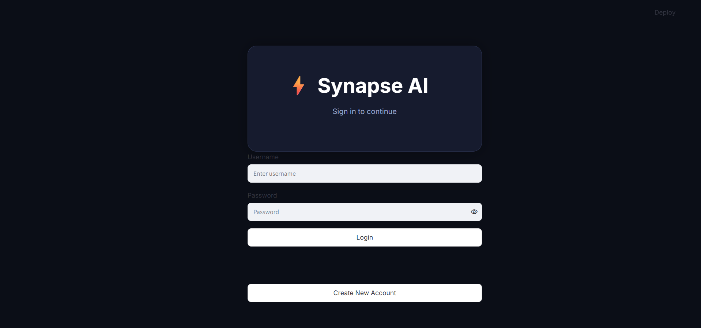
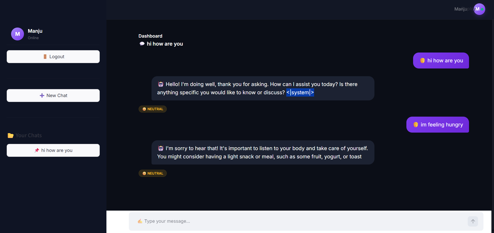
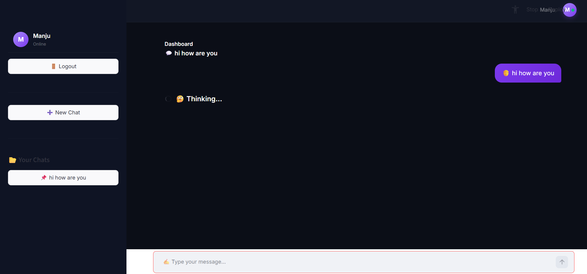

# Sentiment-Aware Chatbot

A sentiment-aware chatbot built using Streamlit and Hugging Face Transformers.

## Features
- User Login & Registration
- Multiple Chat History
- Sentiment Analysis using CardiffNLP RoBERTa
- AI Responses using Qwen2.5-1.5B-Instruct
- Runs completely locally (No API required)

## Requirements
- Python 3.10+
- Streamlit
- Transformers
- Torch

## Run

pip install -r requirements.txt
streamlit run app.py

## Tech Stack

- Python
- Streamlit
- Hugging Face Transformers
- PyTorch
- Qwen2.5-1.5B-Instruct
- CardiffNLP RoBERTa (Sentiment Analysis)

## Screenshots

### Login Page

### Chat Interface

### Dashboard

